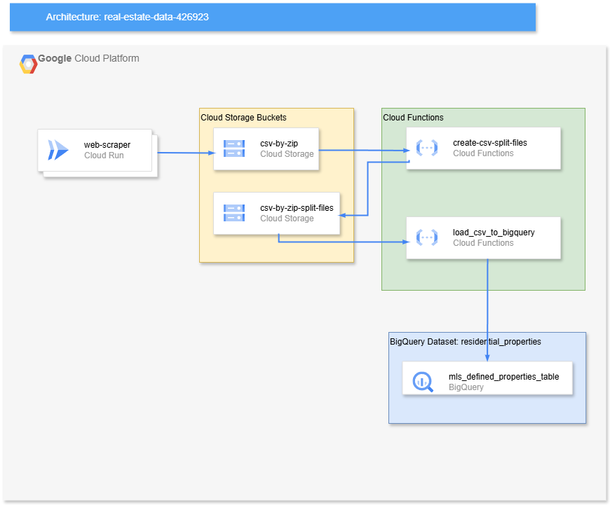

# Load CSV Data To GCP BigQuery

## Overview

This project demonstrates how to use **Google Cloud Functions** and **Google Cloud Storage** to process and load large CSV files into **BigQuery**. The system splits large CSV files containing MLS (Multiple Listing Service) real estate data by ZIP code into smaller files, which are then processed and loaded into BigQuery.

The project architecture involves two Cloud Storage buckets and two Cloud Functions. The functions handle splitting and loading the data efficiently, overcoming the typical timeout constraints of a single-function approach.

## Architecture

- **Cloud Storage Buckets:**
  - `csv-by-zip`: Stores the original large CSV file.
  - `csv-by-zip-split-files`: Stores smaller, split CSV files.
  
- **Cloud Functions:**
  1. **create-csv-split-files**: Splits large CSV files into smaller chunks.
  2. **load_csv_to_bigquery**: Loads split CSV data into BigQuery's `mls_defined_properties_table`.

## Tech Stack

- **Google Cloud Functions (C#)**
- **Google Cloud Storage**
- **BigQuery**
